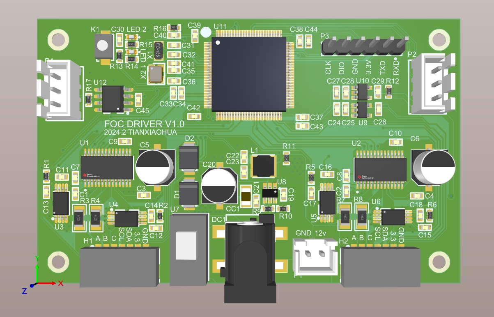
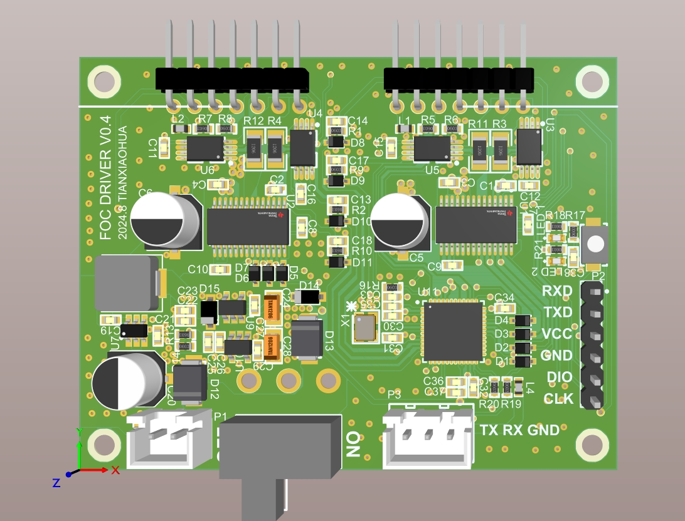

# foc HV 0.3 2024.8.25

## 设计实现

1、完成FOC驱动，可通过串口控制；

2、电源部分正常；

## 存在问题

1、单片机过大，更换小尺寸PCB和单片机，适配新的硬件结构；

2、去掉can总线驱动；

# foc HV 0.4 2024.9.1

 

## 设计实现

1、更换更稳定的外部接口，使用2.54接口适配更广

2、兼容板件连接件；

3、使用更紧凑的PCBA；

4、直接使用串口作为板间通信方案；

